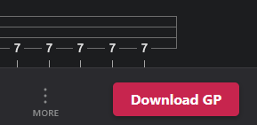

# 🎸 TabGrabberr

   

A lightweight UserScript that adds a floating download button. It fetches the raw Guitar Pro file directly and automatically renames it to a clean format. Use it while this workaround method lasts!

 

## ✨ Features

* **One-Click Download:** Adds a floating button to the bottom right of the screen.
* **Smart Renaming:** Automatically formats downloads as `Artist - Title (ID).gp`.
* **Format Detection:** Detects whether the source file is `.gp`, `.gp5`, or `.gpx`.
* **Zero Dependencies:** Vanilla JavaScript using native fetch. No external APIs or heavy frameworks.

## 📥 Installation

1.  Install a UserScript manager:
    * **Chrome/Edge:** [Tampermonkey](https://www.tampermonkey.net/) or [Violentmonkey](https://violentmonkey.github.io/)
    * **Firefox:** [Violentmonkey](https://addons.mozilla.org/en-US/firefox/addon/violentmonkey/) or [Tampermonkey](https://addons.mozilla.org/en-US/firefox/addon/tampermonkey/)
2.  Click the **Install Script** button at the top of this page, or install it directly from [GreasyFork](https://greasyfork.org/scripts/TU_ID_AQUI).

## 🛠️ Usage

1. Navigate to any song's tab page.
2. Wait for the page to fully load. 
3. Click the red **"Download GP"** button floating at the bottom right.
4. The script will fetch the file, rename it cleanly, and trigger the download.

---
*Made with 🤍 for the guitar community.*